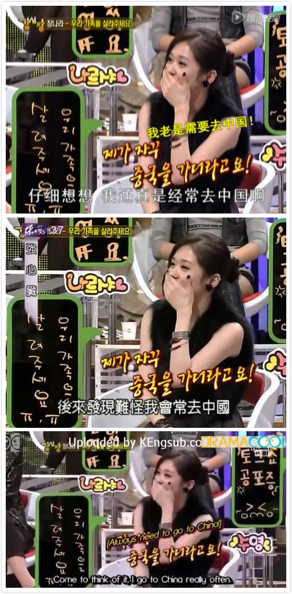
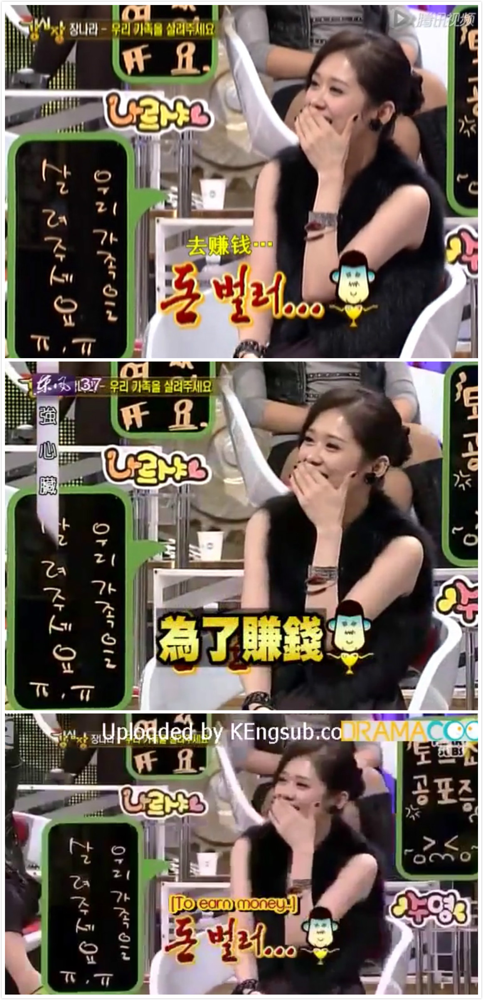
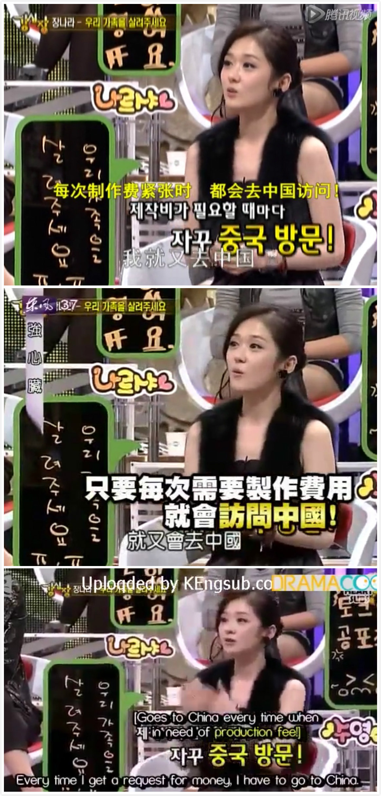

[toc]
# 张娜拉到底说啥了
## 前言
首先声明一下，这篇不是什么洗地文，作者没从这篇文章得到任何好处，作者并非严格意义上的粉丝，只看过她饰演的《刁蛮公主》，对这位演员比较有好感，喜欢她和赵丽颖那种长相。以前听说过所谓的「圈钱门」，没有仔细了解，不过好感度也因此下降不少。今天心血来潮想看看当时究竟是怎么回事，于是有了这篇文章。

一提到张娜拉，大多人首先想到的是她出演的刁蛮公主。有些人可能会因为「圈钱门」对她产生反感；粉丝们则认为这是一出彻底的误会，大大影响了张娜拉的演艺生涯，对此感到十分惋惜；有些人可能会想还好我们有赵丽颖……

「圈钱门」事件发生在 2009 年 11 月，事件的起因是张娜拉参加的一个韩国综艺节目[《强心脏》][1]第三期，张娜拉在节目中说的一番话配上字幕在中国引起了网友的强烈反响，我找不到最初把视频截图发到网络的帖子链接，能找到的最早的报道来自[人民网][2]。

## 三种字幕的视频
我不懂韩语，找了那一期节目的中文简体、繁体和英文字幕三个版本，我们对照着看张娜拉在节目里到底说了什么。

先给出三个视频的链接：  
- [腾讯视频，简体中文字幕，目测来自YYeTs_韩剧精灵][3]  
- [台湾东风卫视，繁体特效字幕][4]  
- [英文字幕][5]

懒得看视频的可以直接看截图（**图中白色常规体字幕是原话，特效字幕是电视台为了娱乐效果自行加上的**）：

- 仔细想想 我还真是经常去中国啊（原话，简体中文翻译）
- 后来发现难怪我会常去中国（原话，繁体中文翻译）
- come to think of it, I go to China really often.(原话，英文翻译)

- 【去赚钱...】（节目自带字幕，简体中文翻译）
- 【为了赚钱】（节目自带字幕，繁体中文翻译）
- 【to earn money】(节目自带字幕，英文翻译）

- 工作人员问没接到什么邀请函吗 我就又去中国（原话，简体中文翻译）
- 工作人员说那个资金没进来，就又会去中国（原话，繁体中文翻译）
- every time I get a request for money, I have to go to China.(原话，英文翻译)

- 【每次制作费紧张时 都会去中国访问！】（节目自带字幕，简体中文翻译）
- 【每次需要制作费用 就会访问中国！】（节目自带字幕，繁体中文翻译）
- 【goes to China every time when in need of production fee!】(节目自带字幕，英文翻译)

## 主观内容
> 以下是作者的主观看法。

很多人愤怒的点在于当时（以及现在）有很多韩国艺人在国内大把捞金，而国内更有一大帮热情的粉丝愿意给偶像滋滋滋送钱。有了张娜拉这么一番话，加上字幕和翻译的添油加醋，瞬间变成愤怒网友的出气口。

我知道他们愤怒的是什么，却不明白为什么愤怒，艺人之所以成为艺人，难道不就是因为能赚大钱？退一万步说，就算张娜拉大声宣告，我来中国就是为了赚钱的！那又如何？难道艺人非得说我喜欢中国的文化你们才能接受？知道对于外国人来说中文多难学吗？更何况[张娜拉的中文发音][8]是我见过的韩国明星里最标准的。

具体到这个节目里张娜拉的部分（也就几分钟），她为了宣传自己主演的电影[《天空与海洋》][6]，在节目中吐槽父亲把自己半年的收入全投入到电影制作中了，这才是她说话的主题好吗！只不过恰好那时候她在中国的人气很高，带来了许多广告邀约，所以顺带提到是把中国的广告收入投入到电影制作中了。

可是为什么会有认为这是对中国市场的不尊重？我给你拍广告，你给我广告费，我在节目里一说，就是对你不尊重？这是什么逻辑？如果那段时间她不是在中国做广告，而是在首尔、在日本，那是不是就不尊重首尔人民、日本人民了？看到了吗，如果把中国换成任何其他国家、地区，甚至某个特定的公司，她都会这样说；假设可口可乐一连请她做了半年的广告，她可能会说「每次制作费紧张了，我都得去喝可乐」，可口可乐会觉得不爽吗？

这年头讨厌一个人越来越容易了，你不需要认识他、见过他，你甚至不需要听过他说的话；几张视频截图，几篇新闻，几段煽动性很强的话，一点点「民族自尊心」，就能让人对他口诛笔伐，至于他到底说过什么，做过什么，谁他妈在乎？

有人还给出了这样的类比：  
> 如果有一天你跟你爸妈说，我回家来看你们就是为了要钱的，没钱才会回家。你爸妈伤心不伤心？

这就属于典型的[不当类比][7]了，虽说观众是艺人的衣食父母，可是真有人回家就是为了要钱，有钱就不回家？类比是用大家熟悉的事物来理解陌生的事物，拿一个不合常理的事情做类比，不是蠢就是坏。你可以把这个类比推广到大多数为了赚钱而出道的艺人身上，够你伤心一辈子了。

维基百科上不当类比的定义： 
> 错误类比（false analogy）、牵强比附、牵强类比、不当类比、或弱类比（weak analogy）是一种非形式谬误，系使用不恰当的类比推论而得出不恰当的结论。犯了这种谬误的人借由比较两件不同事物在某些方面的共同点，来推论这两件不同事物在另外一些方面也必然相同。

我可以举出一堆不当类比：

- 我们工作可以获得工资，所以做家务也必须获得酬劳。  
- 屠夫屠杀动物就和纳粹党屠杀犹太人一样邪恶，因此我们应该禁止屠宰。  
- 我们观众是这些演员的衣食父母。虽然他们不说我也知道，他们说感谢我们都是为了我们的钱，唉，知道孩子这样想真让父母感到寒心。

最后，我今天必须开个地图炮得罪你们一下：  
所有没看过视频就骂人家圈钱的，都是没脑子的傻叉。  
至于看完了视频还骂的，建议换个字幕或者找懂韩语的朋友翻译一下。  
依旧骂的，@杨永信

[1]: https://zh.wikipedia.org/wiki/%E5%BC%B7%E5%BF%83%E8%87%9F
[2]: http://ent.people.com.cn/GB/10344302.html
[3]: https://v.qq.com/x/cover/n8yjlko7mrg0xqu/e0011qmqjqf.html
[4]: https://www.youtube.com/watch?v=z638vIwDdsU&list=PL94D5291B107DCFEE&index=25
[5]: https://gogodramaonline.com/watch/strong-heart-episode-3
[6]: http://v.youku.com/v_show/id_XOTMwOTUwNjU2.html
[7]: https://zh.wikipedia.org/wiki/%E4%B8%8D%E7%95%B6%E9%A1%9E%E6%AF%94
[8]: https://www.youtube.com/watch?v=phOoX21E5Rg