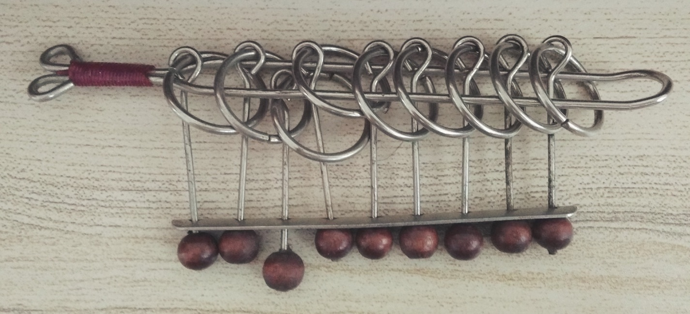
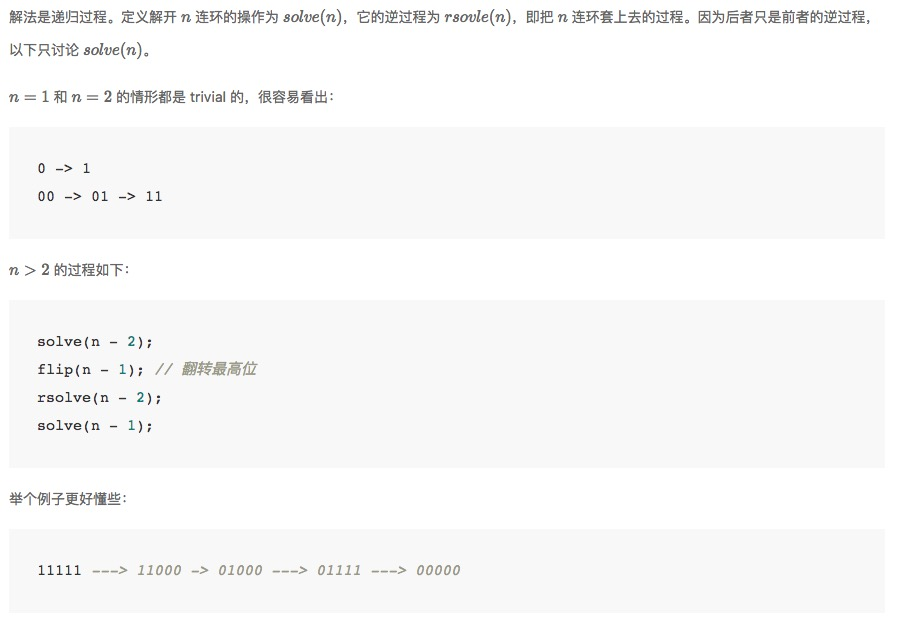

[TOC]
九连环与格雷码
---

> 用九连环理解格雷码，用格雷码解开九连环

### 前言
今天从抽屉里翻出一个九连环，上次玩这东西还是在几年前，不过我把玩几下就回忆起了解法，花了十来分钟解开，又花了十来分钟套上，虽然解九连环花的时间比一般的益智玩具多，但它的解法是最单调和乏味的。解开的过程中不小心发生了这么个情况：我稀里糊涂把 1～8 个环解开了，留下了最后一个环，结果发现自己给自己下了个套——我必须先把解开的 8 个环全部套上。。

对于没玩过九连环的人来说这是非常反直觉的：当只剩下最后一个环时，解开它所需的步骤比解开所有 9 个环（也就是九连环的一般初始状态）还多。为什么会这样呢？那就要从九连环的原理说起了……

### 九连环的原理
看到上面的图了吗，我拍的。。从图中我们可以看到，每个环有两种状态：套在横杠上和不在横杠上，前者我们记为 1，后者我们记为 0。横杠左边是出不去的，只有从右边出，所以我们把最左边称为「最里边」。由于每个环上连着的一根直杆的巧妙作用，每个环只有在某种特定情况下才能从右边脱离横杠。

- 对于最右边的环，可以任意解开或套上
- 对于其他环，只有在「右边环套上，右边的右边全部解开」的情况下，才能解开或套上

用文字解释有点拗口，换成 1 和 0 来表达就是：只有当右边所有环的状态依次为 1(0...)，此环才能活动，(0...)表示任意多个 0，在九连环的情况下是 0~7 个。

一般来讲，每次动作只能解开或套上一个环，但也有例外：最右边两个环可以同时活动（解开或套上），当然，也可以把这类动作分解开来，比如把「同时解开最右边的 11」分解为「先变成 10，再变成 00」。为了接来下分析的方便，我们默认每次都分解这类动作，也就是说，每次只活动一个环。当然，大家在实际玩的过程中，完全可以同时动作。

### 四连环的所有步骤
由于每个环的状态只有解开和套上两种，我们很容易就想到二进制表达，解九连环的方法会和自然数的二进制表达类似吗？解九连环的全部步骤有 341 步，太多了，我们试试想象中的四连环是怎样解开的。

四连环的初始状态是 1111，表示每个环都套在横杠上，我们要把他们全都解开，也就是变成 0000。

| 序号 | 序号的二进制表达 | 四连环的状态 | 四连环状态上下颠倒 |
| --- | -------------- | ---------- | -------------- |
| 0 | 0000 | 1111 | 0000 |
| 1 | 0001 | 1101 | 0001 |
| 2 | 0010 | 1100 | 0011 |
| 3 | 0011 | 0100 | 0010 |
| 4 | 0100 | 0101 | 0110 |
| 5 | 0101 | 0111 | 0111 |
| 6 | 0110 | 0110 | 0101 |
| 7 | 0111 | 0010 | 0100 |
| 8 | 1000 | 0011 | 1100 |
| 9 | 1001 | 0001 | 1101 |
| 10| 1010 | 0000 | 1111 |

很可惜，四连环状态的和步骤序号的二进制表达看起来没什么关系。不过我们注意到四连环相邻两个状态间有且只有一位不同，这是显然的，因为我们每次只活动一个环。  
对于有经验的人，立马就会想到[格雷码][1]，它的特征也是相邻两数之间只有一位不同。格雷码是一种「节省」的设计，举个例子，数字 7 变成 8 时计算机内数位的变化是 0111 -> 1000，同时变化了 4 个位！而我们的格雷码任意相邻两位都只有一位发生了变化。

格雷码后面再接着说，我们先来看看能不能用程序解开九连环，即用程序按顺序输出九连环从初始状态到最终状态之间的所有状态。

### 程序解法
对于程序员，最先想到的应该是递归的方法，而且已经有人写过相关文章，感兴趣的可以点击[这里][2]。
引用链接里的原文：



关于上面这种方法，虽然程序上很好理解，但却不是我们人类解九连环的思考方式，我们来试试能不能用人类的思考方式写出解九连环的代码。

当我们拿到一个别人玩过，或者自己之前玩了玩就放在一边现在重新拿起来玩的九连环，我们会思考：下一步应该怎么做？

根据前面提到的九连环原理，我们能做的其实也不多，实际上可以分为两类：

- 活动最右边的环
- 活动右边状态为 1(0...) 的环

我们思考的具体步骤如下（假设最里面的环还未解开）：

- 彻底解开九连环必须解开最里面的环（我们称之为 r0, 其右边的环依次称为 r1/r2/.../r8）
- 要解开 r0，我们期望 r1 状态为 1
- 接下来要分情况讨论，如果 r1 为 1，那么我们期望 r2～r8 状态全都是 0；如果 r1 为 0，我们必须先把它变成 1，而要把 r1 变成 1，我们期望 r2~r8 的状态为 1(0...)
- 以此类推……

转换成程序语言是这样的：

```javascript
function nextStepOf (s) {
  var a = s.split('').map(v => parseInt(v))
  var limit = a.length - 1
  expect(0, 0)
  return a.join('')
  function expect (index, value) { // 期望 a[index] 值为 value
    if (index === limit) {
      if (a[index] === value) {
        a[index - 1] = a[index - 1] ^ 1
      } else {
        a[index] = value
      }
      return
    }
    if (a[index] !== value) {
      if (oneWithAllZero(index + 1)) { // 右边状态为 1(0...)
        a[index] = value
      } else {
        expect(index + 1, 1)
      }
    } else {
      expect(index + 1, 0)
    }
  }
  function oneWithAllZero (index) {
    if (!a[index]) return false
    for (var i = index + 1; i <= limit; i++) {
      if (a[i]) {
        return false
      }
    }
    return true
  }
}

function solve (start, final) {
  var result = [start]
  while (start !== final) {
    start = nextStepOf(start)
    result.push(start)
  }
  return result
}

console.log(solve('1111','0000'), solve('1000','0000'))
```

复制代码到浏览器控制台执行结果如下：  


这样我们就可以清晰地看到为什么只剩下最里面一个环没解开的步骤比所有环都没解开的步骤还要多了。

不懂 JavaScript 代码也没什么关系，问题的关键在于我们定义了一个函数 `expect`，它接收两个参数，一个是环的序号 `index`，另一个是期望的状态 `value`。前面提到我们期望 r1 的状态为 1，写成代码就是 `expect(1, 1)`，这样程序就和我们的思维一致了，我们都是从最里面的环开始思考的，所以代码中有一句 `expect(0, 0)`。有了这个函数，我们就能确定任意状态下的九连环下一步应该怎么做了！

经过一系列推理演算，我们将这个 `expect` 函数的行为归纳如下：

| expect | 期望值和环的实际状态相符 | 期望值和环的实际状态不符 |
| --- | --- | --- |
| 对于最外边的环 | 活动第二外边的环 | 活动最外边的环 |
| 对于其它位置的环 | 期望右边的环状态为 0，即 `expect(index+1, 0)` | 若右边状态为 1(0...)，活动此环；否则期望右边的环状态为 1，即 `expect(index+1, 1)` |

这里的演算比较麻烦，我写满了一页纸，就不在本文重新推算了，我用此代码检验了 1～19 连环的代码输出，结果正确无误。

实际上，如果进一步推演（我分了四种情况，有些情况还要继续分情况……），你会发现**「活动最右边的环」和「活动右边状态为 1(0...) 的环」这两种动作是交替进行的，与格雷码的一种生成方法不谋而合！也就是说，格雷码同样可以依序表达九连环的所有状态！**

> 这段文字添加于本篇文章发表一个月之后。  
我发现之前写满几页纸的分类讨论可能纯属多余，因为我找到一个更简单的解释来说明为什么上述两种动作必须交替进行。很简单，如果两种动作不是交替进行的话，比如我先「活动最右边的环」，然后又「活动最右边的环」，加起来相当于什么都没做！另一个动作也是同理。换句话说，为了不断改变九连环的状态，我们必须交替进行这两种动作！  
打个比方就是我们看一本书，看完它只需要交替进行两个动作：「看完左边看右边」和「翻页」，这样来看，是不是就很显然了？

### 格雷码的生成方法
引用[维基百科][1]的一段原话：
> 以二进制为0值的格雷码为第零项，第一项改变最右边的位元，第二项改变右起第一个为1的位元的左边位元，第三、四项方法同第一、二项，如此反复，即可排列出n个位元的格雷码。

此种方式代码实现如下：

```javascript
function generateGrayCode (n) {
  var start = Array(n).fill(0)
  var flag = true
  var result = []
  result.push(start.slice())
  for (var i = 0; i < (1 << n) - 1; i++) {
    if (flag) {
      start = changeRightMost(start)
      result.push(start.slice())
    } else {
      start = changeOther(start)
      result.push(start.slice())
    }
    flag = !flag
  }
  return result
}

function changeRightMost (arr) { // 改变最右边的位元
  arr[arr.length - 1] = arr[arr.length - 1] ^ 1
  return arr
}

function changeOther (arr) { // 改变右起第一个为1的位元的左边位元
  for (var i = arr.length - 1; i > 0; i--) {
    if (arr[i]) {
      arr[i - 1] = arr[i - 1] ^ 1
      break
    }
  }
  return arr
}

console.table(generateGrayCode(4))
```

> 除此之外还有一种「镜射排列」的方式生成格雷码，通过这种方式，我们可以结合数学归纳法，比较方便地证明格雷码所有相邻两数都只有一个位元不同，感兴趣的读者可以查看维基并尝试证明。  
有趣的是，这种「镜射排列」的方式恰恰对应了前面提到的[递归方法][2]，不知道这种格雷码生成方式的发明者是不是从九连环里得到的启发。


到目前为止，我们已经掌握了两种九连环的程序解法，还有没有更高科技的方法呢？  
答案是有的，方法来自格雷码和二进制数的神奇联系。

### 格雷码和二进制数的关系
引用维基原文：
> 二进制码第n位 = 二进制码第（n+1）位+格雷码第n位。因为二进制码和格雷码皆有相同位数，所以二进制码可从最高位的左边位元取0，以进行计算。（注：遇到1+1时结果视为0）

[这篇英文文章][3]有很生动的图像解释。

我不太清楚这条性质是怎么推算出来的，不过理解它很容易，举例来说：

> 对于某个四位二进制数 b3 b2 b1 b0，它对应的格雷码记为 g3 g2 g1 g0
我们假设这个二进制数的下一个数没有发生进位，那么下一位可以表达为 b3 b2 b1 b0'，其中 b0' 表示 0 位与前一个数的 0 位不同，那么它对应的格雷码是 g3 g2 g1 g0'，**满足相邻的格雷码只有一位不同。**  
如果下一个数发生了进位，不妨设进位一直进到了 b2, 那么其二进制表达为 b3 b2' b1' b0'，对应的格雷码是 g3 g2' g1 g0，只有 2 位发生了变化，同样满足相邻的格雷码只有一位不同。易知进位到其它位也是同理，所以**用这套转换方法转换出来的格雷码满足相邻的格雷码只有一位不同。**  

有了这条性质以后我们就可以方便地将格雷码和二进制数相互转化了！代码实现如下：

```javascript
function grayToBinary (s) {
  var r = [0]
  for (var i = 1; i <= s.length; i++) {
    r[i] = r[i - 1] ^ s[i - 1]
  }
  r.shift()
  return r.join('')
}
grayToBinary('0111') // '0101'

function binaryToGray (s) {
  var r = []
  var a = s.split('').map(v => parseInt(v))
  a.unshift(0)
  for (var i = 0; i < s.length; i++) {
    r[i] = a[i] ^ a[i + 1]
  }
  return r.join('')
}
binaryToGray('0101') // '0111'
```
更妙的是，有了这两个转换方法，我们可以轻易构造出新的判断下一步状态的方法：先把九连环的状态（即格雷码）转换为二进制数，把二进制数加一，接着再转换回格雷码，最终得到的结果就是九连环下一步的状态了。


[1]: https://zh.wikipedia.org/wiki/%E6%A0%BC%E9%9B%B7%E7%A0%81
[2]: https://ericfu.me/solve-chinese-rings/
[3]: https://testbook.com/blog/conversion-from-gray-code-to-binary-code-and-vice-versa/